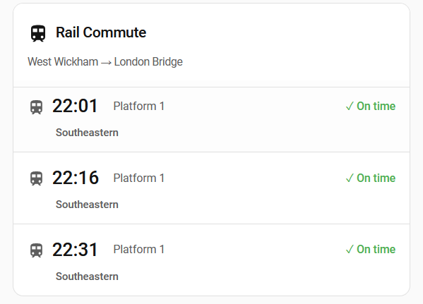

# My Rail Commute Card

[](https://github.com/hacs/integration)
[](https://github.com/adamf83/lovelace-my-rail-commute-card/releases)
[](LICENSE)

A beautiful, feature-rich custom Lovelace card for Home Assistant that displays UK rail departure information in a station-board-inspired interface. Designed to work seamlessly with the My Rail Commute integration.



## Features

✨ **Multiple View Modes**
- **Full View**: Complete train information with all details
- **Compact View**: Space-efficient layout for mobile dashboards
- **Next-Only View**: Focus on the immediate next train
- **Departure Board View**: Classic UK station board aesthetic

🎨 **Beautiful Design**
- Mimics real railway station departure boards
- Auto, light, and dark theme support
- Customizable colors for each status
- Smooth animations and transitions
- Responsive design for all screen sizes

⚙️ **Highly Customizable**
- Show/hide any information (platform, operator, calling points, delay reasons)
- Filter trains by delay time or disruption status
- Adjustable font sizes
- Compact height mode
- Custom tap, hold, and double-tap actions

📱 **Interactive**
- Tap to view more information
- Hold to refresh data
- Visual feedback on interactions
- **Toggle between outbound and return journeys** with one tap (auto-detected)
- **Reliability statistics panel** with on-time rates and delay trends (tap the chart icon)

🖱️ **Easy Configuration**
- Visual card editor in Lovelace UI
- No manual YAML editing required (but supported!)
- Comprehensive examples included

## Installation

### HACS (Recommended)

1. Open HACS in Home Assistant
2. Go to "Frontend"
3. Click the "+" button
4. Search for "My Rail Commute Card"
5. Click "Install"
6. Refresh your browser

### Manual Installation

1. Download `my-rail-commute-card.js` from the [latest release](https://github.com/adamf83/lovelace-my-rail-commute-card/releases)
2. Copy it to `/config/www/my-rail-commute-card.js`
3. Add the resource to your Lovelace configuration:

   ```yaml
   resources:
     - url: /local/my-rail-commute-card.js
       type: module
   ```

4. Refresh your browser

## Quick Start

### Basic Configuration

Add this to your Lovelace dashboard:

```yaml
type: custom:my-rail-commute-card
entity: sensor.morning_commute_summary
```

That's it! The card will display with sensible defaults.

### Using the Visual Editor

1. In edit mode, click "Add Card"
2. Search for "My Rail Commute Card"
3. Select your summary entity
4. Configure options using the visual interface
5. Save!

## Configuration

### Full Configuration Options

```yaml
type: custom:my-rail-commute-card
entity: sensor.morning_commute_summary

# Display Options
title: Morning Commute
view: full                    # Options: full | compact | next-only | board
theme: auto                   # Options: auto | light | dark
show_header: true
show_route: true
show_last_updated: false

# Train Details
show_platform: true
show_operator: true
show_calling_points: false
show_delay_reason: true
show_journey_time: false
max_calling_points: 3

# Filtering
hide_on_time_trains: false
only_show_disrupted: false
min_delay_to_show: 0          # Only show trains delayed by X+ minutes

# Styling
font_size: medium             # Options: small | medium | large
compact_height: false         # Reduce vertical spacing
show_animations: true         # Enable transition animations
status_icons: true            # Show ✓ ⚠️ ❌ icons

# Interaction
tap_action:
  action: more-info           # Options: more-info | url | navigate | none
hold_action:
  action: refresh
double_tap_action:
  action: none

# Statistics / History Panel
show_history_panel: false     # Enable reliability stats toggle in footer
history_days: 7               # Days to show in panel (max 30)

# Advanced
disruption_entity: binary_sensor.morning_commute_severe_disruption
status_entity: sensor.morning_commute_status   # Auto-discovered if omitted
refresh_interval: 60

# Custom Colors (optional)
colors:
  on_time: '#4caf50'
  minor_delay: '#ff9800'
  major_delay: '#f44336'
  cancelled: '#d32f2f'
```

### Configuration Options Reference

| Option | Type | Default | Description |
|--------|------|---------|-------------|
| `entity` | string | **Required** | Your rail commute summary sensor entity |
| `title` | string | 'Rail Commute' | Card title |
| `view` | string | 'full' | View mode: `full`, `compact`, `next-only`, or `board` |
| `theme` | string | 'auto' | Theme: `auto`, `light`, or `dark` |
| `show_header` | boolean | true | Show card header |
| `show_route` | boolean | true | Show origin → destination |
| `show_last_updated` | boolean | false | Show last update time |
| `show_platform` | boolean | true | Show platform numbers |
| `show_operator` | boolean | true | Show train operator |
| `show_calling_points` | boolean | false | Show calling points list |
| `show_delay_reason` | boolean | true | Show delay reasons |
| `show_journey_time` | boolean | false | Show journey duration (* shown if delayed) |
| `max_calling_points` | number | 3 | Max calling points to display |
| `hide_on_time_trains` | boolean | false | Only show delayed/cancelled trains |
| `only_show_disrupted` | boolean | false | Only show when disruption sensor is on |
| `min_delay_to_show` | number | 0 | Minimum delay in minutes to show train |
| `font_size` | string | 'medium' | Font size: `small`, `medium`, or `large` |
| `compact_height` | boolean | false | Reduce vertical spacing |
| `show_animations` | boolean | true | Enable animations |
| `status_icons` | boolean | true | Show status icons (✓ ⚠️ ❌) |
| `show_history_panel` | boolean | false | Show reliability statistics toggle in the card footer |
| `history_days` | number | 7 | Days of history to display in the statistics panel (max 30) |
| `disruption_entity` | string | - | Binary sensor for disruption detection |
| `status_entity` | string | - | Status sensor entity (auto-discovered by naming convention) |
| `refresh_interval` | number | 60 | Seconds between updates |
| `tap_action` | object | `{action: 'more-info'}` | Action on tap |
| `hold_action` | object | `{action: 'refresh'}` | Action on hold |
| `colors` | object | - | Custom status colors |
| `show_connection_details` | boolean | true | Multi-leg journeys only: show interchange times/buffer/summary text on the connection row |
| `show_non_catchable_indicator` | boolean | true | Multi-leg journeys only: show a ✂ badge on trains that won't make the next connection |

## View Modes

### Full View

The default view showing all train information with complete details.

```yaml
type: custom:my-rail-commute-card
entity: sensor.morning_commute_summary
view: full
```

**Perfect for:**
- Desktop dashboards
- Detailed monitoring
- Full information display

### Compact View

Space-efficient layout showing essential information only.

```yaml
type: custom:my-rail-commute-card
entity: sensor.morning_commute_summary
view: compact
compact_height: true
```

**Perfect for:**
- Mobile dashboards
- Limited screen space
- Quick glance information

### Next-Only View

Shows only the next departing train with full details.

```yaml
type: custom:my-rail-commute-card
entity: sensor.morning_commute_summary
view: next-only
show_calling_points: true
font_size: large
```

**Perfect for:**
- Focus on immediate departure
- Glanceable displays
- Wall-mounted tablets

### Departure Board View

Classic UK railway station board aesthetic with monospace font.

```yaml
type: custom:my-rail-commute-card
entity: sensor.morning_commute_summary
view: board
```

**Perfect for:**
- Authentic station board look
- Retro aesthetic
- Public displays

## Route Toggling & Statistics

### Switching Between Outbound and Return Journeys

If your My Rail Commute integration has both an outbound and a return route configured, the card automatically detects the return sensor and displays a **swap button** (⇄) in the card header. Tapping it flips the display between your two directions — trains, route label, and disruption banner all update instantly.

No configuration is needed; the card discovers the return entity by naming convention (e.g. `sensor.evening_commute_summary` is detected automatically when viewing `sensor.morning_commute_summary`). The toggle only appears when a matching return entity is found.

### Reliability Statistics Panel

Enable the statistics panel to see how punctual your route has been over time. A **chart button** appears in the card footer; tap it to expand or collapse the panel.

```yaml
type: custom:my-rail-commute-card
entity: sensor.morning_commute_summary
show_history_panel: true
history_days: 14          # How many days to display (default 7, max 30)
```

The panel shows:

| Metric | Description |
|--------|-------------|
| **Today** | On-time percentage for today so far |
| **7-day** | Rolling 7-day on-time percentage |
| **30-day** | Rolling 30-day on-time percentage |
| **Avg delay** | Average delay in minutes over 7 days |

Below the KPIs, a colour-coded grid shows each day at a glance:

- 🟩 **Green** — 90 %+ on time
- 🟨 **Amber** — 70–89 % on time
- 🟥 **Red** — below 70 % on time

The best and worst performing days in the window are highlighted at the bottom of the panel.

> **Requires** the `*_historical_reliability` and `*_historical_delays` sensors from the My Rail Commute integration. If those sensors haven't populated yet, the panel shows a "No reliability data available yet" message.

## Multi-Leg Connection Journeys

If your My Rail Commute integration is configured with a change of train partway through (e.g. Home → Interchange, then a different service Interchange → Work), the card automatically switches to a leg-by-leg layout — no card configuration is required to turn this on. It activates as soon as the configured summary entity's `is_multi_leg` attribute is `true`.

Each leg is shown as its own grouped section (numbered "1.", "2." …, with the leg's origin → destination and a status dot), with a **connection row** between each pair of legs showing:

- The interchange station ("Change at Reading")
- The incoming arrival time and the matched outgoing departure time
- The buffer in minutes between them
- A human-readable summary of the connecting service

The connection row is colour-coded and icon-coded by status, mirroring the integration's own connection sensor:

| Status | Icon | Meaning |
|--------|------|---------|
| Connection OK | 🔄 | Comfortably achievable |
| Tight Connection | ⏰ | Achievable, but with little spare time |
| Delayed Connection | ⏰ (red) | You'll miss the planned train, but a later one still works |
| Missed Connection | 🛑 | No tracked service leaves in time |
| Unknown | ❔ | Not enough data to judge |

If any connection is missed, a red banner appears reading "This journey is not currently achievable" (driven by the sensor's `journey_feasible` attribute), in addition to the normal disruption banner.

Trains that won't make the next leg's connection (`catchable: false`) show a small ✂ badge next to their status — this can be hidden with `show_non_catchable_indicator: false`. The connection row's detail text (times/buffer/summary) can be hidden with `show_connection_details: false` if you just want the coloured status indicator.

```yaml
type: custom:my-rail-commute-card
entity: sensor.morning_commute_summary
view: full
show_connection_details: true
show_non_catchable_indicator: true
```

The **Departure Board** view renders each leg as its own mini station-board table, with a dashed connection divider row between them. The **Next Train Only** view shows just the next train for each leg. The top-level `Summary`/`Status` sensors (and the disruption banner) already reflect the worst case across all legs and connections, so no separate configuration is needed there.

> **Note**: Historical Reliability/Delays statistics report on the combined whole journey, not broken down per leg.

## Examples

### Morning Commute Dashboard

```yaml
type: vertical-stack
cards:
  - type: custom:my-rail-commute-card
    entity: sensor.morning_commute_summary
    title: Morning Trains
    view: full
    show_delay_reason: true

  - type: conditional
    conditions:
      - entity: binary_sensor.morning_commute_severe_disruption
        state: "on"
    card:
      type: markdown
      content: |
        ## ⚠️ Service Disruption Alert
        There is currently severe disruption on your route.
        Check National Rail for updates.
```

### Mobile-Optimized Compact Card

```yaml
type: custom:my-rail-commute-card
entity: sensor.morning_commute_summary
view: compact
compact_height: true
show_header: false
font_size: small
show_animations: false
```

### Delayed Trains Only

```yaml
type: custom:my-rail-commute-card
entity: sensor.morning_commute_summary
title: Delayed Services
hide_on_time_trains: true
min_delay_to_show: 5
show_delay_reason: true
colors:
  minor_delay: '#ff9800'
  major_delay: '#f44336'
```

### Classic Departure Board

```yaml
type: custom:my-rail-commute-card
entity: sensor.morning_commute_summary
view: board
show_header: false
theme: dark
```

### Next Train with Navigation

```yaml
type: custom:my-rail-commute-card
entity: sensor.morning_commute_summary
view: next-only
title: Next Departure
show_calling_points: true
tap_action:
  action: url
  url_path: https://www.nationalrail.co.uk/
```

## Automations

See [examples/automations.yaml](examples/automations.yaml) for complete automation examples including:

- Notify on severe disruption
- Alert when train is delayed
- Morning commute reminder
- TTS announcements via smart speakers
- Flash lights on cancellation
- Conditional dashboard visibility

## Troubleshooting

### Card Not Showing

**Problem:** Card appears as "Custom element doesn't exist: my-rail-commute-card"

**Solution:**
1. Verify the card is installed in `/config/www/` or via HACS
2. Check that you've added the resource to your Lovelace configuration
3. Hard refresh your browser (Ctrl+Shift+R or Cmd+Shift+R)
4. Clear browser cache
5. Check browser console for errors

### No Trains Displayed

**Problem:** Card shows "No trains found"

**Solution:**
1. Verify your My Rail Commute integration is working
2. Check that the entity specified in the card config exists
3. Check the entity state in Developer Tools → States
4. Verify the entity has `all_trains` attribute with data
5. Check your time window configuration in the integration

### Entity Not Found

**Problem:** "Entity not found: sensor.xxx"

**Solution:**
1. Verify the entity ID is correct
2. Check if the My Rail Commute integration is properly configured
3. Restart Home Assistant if you just added the integration
4. Check Developer Tools → States to find the correct entity ID

### Styles Not Applied

**Problem:** Card looks unstyled or broken

**Solution:**
1. Hard refresh your browser
2. Check browser console for CSS loading errors
3. Verify you're using a compatible browser (Chrome, Firefox, Safari, Edge)
4. Try switching to a different theme in the card config

### Icons Not Showing

**Problem:** Icons appear as boxes or are missing

**Solution:**
1. Ensure Home Assistant has internet connectivity (for loading MDI icons)
2. Hard refresh your browser
3. Check if other cards with icons work properly
4. Try disabling status_icons: `status_icons: false`

### Editor Not Working

**Problem:** Visual editor doesn't appear or is broken

**Solution:**
1. Verify you're in edit mode (click three dots → Edit Dashboard)
2. Check browser console for JavaScript errors
3. Try manual YAML configuration instead
4. Ensure your Home Assistant is up to date

## Development

### Building from Source

```bash
# Clone the repository
git clone https://github.com/adamf83/lovelace-my-rail-commute-card.git
cd lovelace-my-rail-commute-card

# Install dependencies
npm install

# Build
npm run build

# Watch mode (auto-rebuild on changes)
npm run watch
```

The built file will be in `dist/my-rail-commute-card.js`.

### Testing Locally

1. Build the project: `npm run build`
2. Copy `dist/my-rail-commute-card.js` to `/config/www/`
3. Add as a resource with `?v=X` parameter to bust cache:
   ```yaml
   resources:
     - url: /local/my-rail-commute-card.js?v=1
       type: module
   ```
4. Increment `v` parameter each time you update

### Project Structure

```
lovelace-my-rail-commute-card/
├── src/
│   ├── my-rail-commute-card.js    # Main card component
│   ├── styles.js                   # CSS styles
│   ├── editor.js                   # Visual editor
│   └── utils.js                    # Helper functions
├── dist/                           # Built files
├── examples/                       # Example configurations
├── screenshots/                    # Screenshots for docs
├── package.json                    # Dependencies
├── rollup.config.js               # Build config
└── README.md                       # This file
```

## Contributing

Contributions are welcome! Please feel free to submit a Pull Request.

### Guidelines

1. Fork the repository
2. Create a feature branch (`git checkout -b feature/amazing-feature`)
3. Make your changes
4. Test thoroughly
5. Commit your changes (`git commit -m 'Add amazing feature'`)
6. Push to the branch (`git push origin feature/amazing-feature`)
7. Open a Pull Request

## Support

- 📖 [Documentation](https://github.com/adamf83/lovelace-my-rail-commute-card)
- 🐛 [Issue Tracker](https://github.com/adamf83/lovelace-my-rail-commute-card/issues)
- 💬 [Community Forum](https://community.home-assistant.io/)

## Changelog

See [CHANGELOG.md](CHANGELOG.md) for version history.

## License

This project is licensed under the MIT License - see the [LICENSE](LICENSE) file for details.

## Credits

- Built with [Lit](https://lit.dev/)
- Icons from [Material Design Icons](https://materialdesignicons.com/)
- Inspired by UK railway station departure boards

## Related Projects

- [My Rail Commute Integration](https://github.com/adamf83/uk-rail-commute) - The integration this card is designed for
- [UK Transport Sensor](https://github.com/other/uk-transport) - Alternative transport integration

---

Made with ❤️ for the Home Assistant community
